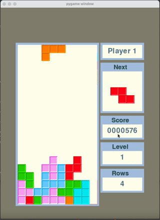

# py-Tetris

A tetris implementation in Python using pygame. This effort of mine is dedicated to the memory of [Jonas Neubauer](https://en.wikipedia.org/wiki/Jonas_Neubauer), the 7-time [Classic Tetris World champion](https://en.wikipedia.org/wiki/Jonas_Neubauer).

## V.1.0

{:height="50%" width="50%"}

1. Random method: double bag.
2. Score calculated based on NES rules.
3. Level calculated based on NES rules.
4. Speed is kept constant across all levels. 
5. Score/next tetromino/level/cleared rows shown on side panel.

### Requirements

* Python 3.6
* [pygame](https://www.pygame.org/news)
* [numpy](https://numpy.org/)

### TODOs

* Side movement of the tetrominos not cool.
* Implement [wall-kick](https://tetris.wiki/Super_Rotation_System#Wall_Kicks)
* Develop some db to store high-scores.
* Develop two-player front end.
