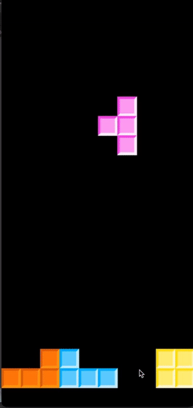

# py-Tetris

A tetris implementation in Python using pygame. This effort of mine is dedicated to the memory of [Jonas Neubauer](https://en.wikipedia.org/wiki/Jonas_Neubauer), the 7-time [Classic Tetris World champion](https://en.wikipedia.org/wiki/Jonas_Neubauer).

## V.0.1

### Requirements

* Python 3.6
* [pygame](https://www.pygame.org/news)
* [numpy](https://numpy.org/)

### Specification

Tetris rules are implemented defied for [NES tetris](https://tetris.fandom.com/wiki/Tetris_Wiki) (more or less). 

### TODOs

* Implement scoring according to NES rules.
* Implement [wall-kick](https://tetris.wiki/Super_Rotation_System#Wall_Kicks)
* Develop matrix frame to show score and the nex tetromino.
* Develop some db to store high-scores.
* Develop two-player front end.
